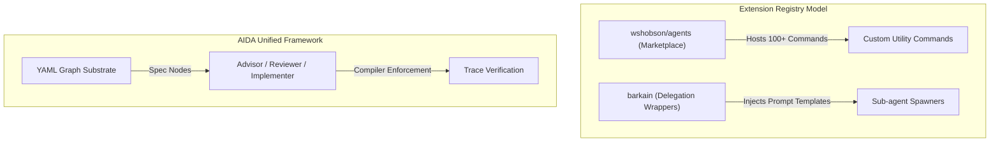

# Category Summary: Agent Libraries & Extension Marketplaces

**Last updated**: 2026-05-22  
**Ecosystem Lens**: Extensibility Architectures & Custom Command Registries

As native AI coding interfaces (like Claude Code, Cursor, and Codex) establish themselves, a rich ecosystem of developer-facing **agent libraries, plugins, and custom commands** has emerged. These extensions allow developers to customize agent behavior and adapt them to specific tasks.

This summary surveys the agent extensibility landscape, focusing on Seth Hobson's command marketplace (`wshobson/agents`) and Nadav Barkai's workflow delegation plugins (`barkain`), and defines how AIDA's unified platform approach compares.

---

## The Landscape: Plugins vs. Cohesive Platforms

Ecosystem extensibility has split into two core models:

### 1. The Marketplace / Command Registry Model (e.g., `wshobson/agents`)
*   **Approach**: Houses a large-scale, community-driven registry of plugins, pre-packaged agents, and custom Claude Code commands (e.g., `/plugin add`).
*   **Scope**: Extremely broad, offering general-purpose utility extensions (such as API connectors, git logs, database checkers, and code formatters).
*   **Limitations**: Scattered and low-cohesion. Because these commands are developed independently by the community, they share no common state, hold no structural opinion about delivery workflows, and do not communicate. They act as a toolbox of separate, stateless utilities.

### 2. The Prompt Delegation / Planning Wrapper Model (e.g., `barkain`)
*   **Approach**: Provides specialized prompt frameworks that enable agents to enter "plan modes," spawn transient sub-agents, and delegate sub-tasks dynamically.
*   **Scope**: Focused on workflow execution and runtime task delegation.
*   **Limitations**: Operates purely within the transient prompt context. These delegation wrappers have no local filesystem state, stable node-aware identifiers, or compiler-enforced trace linkages in the source code. Once the agent run completes, the history and delegation state disappear.

---

## Deep-Dive Comparison

| Attribute | Extension Registry (`wshobson/agents`) | Delegation Wrappers (`barkain`) | AIDA (Unified Substrate) |
|---|---|---|---|
| **Design Concept** | Stateless Tool Belt / Utility | In-Context Prompt Wrapper | Git-Native intent & Runtime |
| **State persistence** | None (Transient commands) | None (In-context memory) | **Durable (requirements.yaml & IDs)** |
| **Process Control** | Basic Shell Executions | In-prompt Sub-Agent Spawns | **Strict Role-Pure Git Worktrees** |
| **Code Linkage** | None | None | **Trace-Comment Compliance** |
| **Integration Path** | Extends native platform CLI | Prompt template insertions | **Exposes intent via Local MCP** |

---

## AIDA's Differentiator: Cohesive Intent

AIDA does not seek to be a general-purpose marketplace of individual utility commands. Instead, AIDA is a **cohesive software delivery framework** built around a unified requirements graph:

1.  **Unified Command Suite**: Rather than a collection of unrelated community utilities, AIDA's slash commands (e.g., `/aida-status`, `/aida-review`, `/aida-req`) are designed to serve a singular, highly integrated workflow: creating, tracking, implementing, and verifying repository specifications.
2.  **Durable Planning & Delegation**: Unlike transient "plan mode" prompt prompts, AIDA's planning protocol is anchored in git-versioned, compiler-verified markdown templates under `docs/plans/` that are programmatically linked to stable spec IDs.
3.  **Local Context Expose**: Instead of requiring custom plugins to inject context, AIDA serves its entire requirements, relationships, and history graph over the **Model Context Protocol (MCP)**. This makes AIDA's intent graph instantly readable by *any* MCP-compatible agent (including Cursor, Codex, Gemini, and Claude Code) without requiring specialized client-side extensions.

---

## Strategic Summary

While custom command marketplaces and workflow delegation libraries provide valuable extensions for day-to-day utility tasks, they lack the structural state, stable identities, and code-level trace compliance necessary to coordinate complex software changes. By serving a cohesive, git-native requirements index over an open protocol (MCP), AIDA delivers a unified collaboration layer that provides durability and auditability far beyond stateless plugins.
