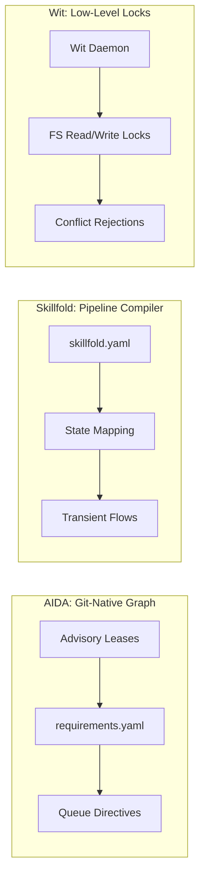

# Category Summary: Coordination Protocols

**Last updated**: 2026-05-22  
**Ecosystem Lens**: Agent-to-Agent Coordination & Concurrency Primitives

In multi-agent environments, the greatest point of failure is not individual agent capability, but **coordination concurrency**—how agents share state, avoid write conflicts, and resolve task dependencies without stepping on each other or creating infinite loops.

This summary analyzes the emerging coordination protocol landscape, integrating lessons from our Skillfold Spike and Wit lock studies.

---

## The Landscape: Three Paradigms of Coordination

The industry has fragmented into three distinct approaches to managing agent collaboration:

### 1. Declarative Compilers (e.g., Skillfold)
*   **Approach**: Defines multi-agent coordination statically in a central YAML manifest (`skillfold.yaml`), detailingcomposed skills, typed state schemas, and team flow graphs. Compiles this representation down into native instruction sets for 12+ execution backends.
*   **State Model**: Binds state variables dynamically to external web infrastructure (GitHub issues/PRs/discussions) or transient local JSON files.
*   **Limitations**: Skillfold is a pipeline compiler, not a runtime. It has no native ability to manage filesystem locks, handle in-flight task failures, or resolve active lease contentions.

### 2. Lock Daemons (e.g., Wit)
*   **Approach**: Implements a low-level, reactive daemon (`wit`) that sits inside the filesystem, intercepting and locking git worktrees and files to prevent concurrent agent threads from performing overlapping writes.
*   **State Model**: Stateless filesystem locks and git branch sentinels.
*   **Limitations**: Extremely narrow. It prevents conflicts at the command execution layer, but holds no context on *why* the agents are writing, what the task requirements are, or how to resolve the conflict intelligently. It simply returns a write rejection.

### 3. Git-Native Intent Graphs (e.g., AIDA)
*   **Approach**: Integrates coordination into the shared repository substrate via a local requirements graph, pairing it with active execution primitives:
    *   **Advisory Leases**: Headless agent processes claim short-term, scope-bounded advisory leases on specific requirements (e.g. `STORY-260`) to declare work intent.
    *   **Queue Directives**: Primitives like `post_directive` and `claim_directive` coordinate schedules across agents via a local FIFO queue.
*   **State Model**: Fully version-controlled, YAML-canonical requirements graph stored directly in `.aida-store/` and subject to git merges.

---

## Deep-Dive Comparison

| Metric | Skillfold (Compiler) | Wit (Daemon Lock) | AIDA (Intent Graph) |
|---|---|---|---|
| **Coordination Type** | Static / Transient Pipeline | Dynamic / Reactive Lock | Semantically Aware / Cooperative Lease |
| **State Persistence** | External (GitHub API / JSON) | Volatile (Filesystem Handles) | Git-Native Local Ledger |
| **Write Conflict Handling** | Ignored (Assumes isolation) | Rejected (Blocks execution) | Proactive (Queued Leases) |
| **Tool Scope** | Cross-Platform Codebase Scaffold | Git Worktree Utility | Unified Project intent & Runtime |

---

## Integration & Strategic Positioning

Rather than treating these coordination protocols as mutually exclusive, AIDA leverages a hybrid integration strategy:

1.  **Skillfold Composition**: As documented in our Skillfold investigation, AIDA uses its Rust scaffolding engine to generate highly portable markdown rules that map to skillfold's atomic format. This gives AIDA-scaffolded skills immediate cross-platform reach (Cursor, Windsurf, Gemini) while preserving AIDA's custom interactive slash commands.
2.  **Wit Co-existence**: AIDA's coordination layer operates at a higher semantic level than Wit. While AIDA prevents logical lease conflicts on specific requirements, Wit can serve as an excellent lower-level backup to ensure that raw file write collisions do not occur when multiple agents are running in the same git worktree.

By combining the semantic clarity of the **Requirements Graph** with local **Advisory Leases**, AIDA establishes a highly reliable, zero-SaaS collaboration layer that ensures silicon interns always work in harmony.
