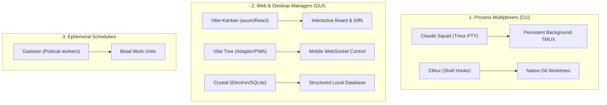

# Category Summary: Parallel Session Managers

**Last updated**: 2026-05-22  
**Ecosystem Lens**: Workspace Isolation & Process-level Session Multiplexing

When pairing with multiple AI coding agents, developers face a major bottleneck: **workspace pollution**. Spawning multiple agents in the same git branch results in write conflicts, broken builds, and dirty git states.

This summary analyzes the **parallel session manager** landscape—systems designed to run multiple agent instances concurrently using isolated environments—and cross-references the empirical findings from our [Terminal User Interface Prior-Art Study](../tui-prior-art.md).

---

## The Landscape: How We Isolate Workspaces

The competitive field utilizes three distinct hosting models to isolate and manage parallel agent runs:

### 1. Process Multiplexers (e.g., Claude Squad, CMux)
*   **Approach**: Uses low-level terminal utilities (`tmux`) or native shell scripting (`bash`/`zsh` integration) to spawn and switch between isolated agent environments.
*   **Isolation**: Relies on standard Git worktreeschecked out under hidden directories (e.g. `.worktrees/`).
*   **Pros**: Light memory footprints, fast startup times, and high process survivability (background TMUX sessions survive SSH disconnects).
*   **Cons**: High cognitive load. Lacks visual dashboards or structured state tracking, requiring developers to manually query progress and remember keybindings.

### 2. Web & Desktop Workspace Managers (e.g., Vibe-Kanban, Vibe Tree, Crystal)
*   **Approach**: Hosts React-based web apps or Electron desktop wrappers, communicating with Rust or Node backends via WebSockets or IPC.
*   **Isolation**: Parallel git worktrees mapped to structured SQL databases (SQLite) tracking project history, console scrollback, and raw tool outputs.
*   **Pros**: Rich, accessible visualization. Features drag-and-drop Kanban task boards, side-by-side git diff viewers with inline comment feedback loops, and remote mobile pairing via PWAs.
*   **Cons**: Heavy resource overhead. Running multiple Electron shells or full-stack web servers introduces substantial CPU and memory footprints.

### 3. Ephemeral Schedulers (e.g., Gastown)
*   **Approach**: Runs ephemeral background worker threads ("polecats") overseen by a central coordinator ("Mayor"). Work units are checked in and out as git-canonical files called "Beads."
*   **Pros**: Extreme scalability. Ephemeral workers are spun up on demand, complete their git work unit, and are immediately destroyed.
*   **Cons**: Lacks active interactive loops. Developers cannot easily intercede in a running worker or attach to its live session.

---

## Deep-Dive Comparison

| System | Hosting Model | State Persistence | Primary View | Developer Focus |
|---|---|---|---|---|
| **Claude Squad** | Tmux PTY | Config JSON | Split-pane TMUX | Quick Terminal Attach |
| **CMux** | Shell Scripts | Git Worktrees | Native Command Line | Lightweight Minimalist |
| **Gastown** | Ephemeral Coordinator | Git "Beads" | CLI Log Output | Highly Scalable Schedulers |
| **Vibe Kanban** | axum Web / React | SQLite DB | Kanban Task Board | Visual Human-in-the-Loop |
| **Vibe Tree** | Electron / PWA | SQLite DB | WebSocket Terminal | Remote & Multi-Device |
| **Crystal** | Electron / React | SQLite DB | Hierarchical Tabs | Power Desktop User |
| **AIDA** | **Survivable PTY** | **Git Spec Graph** | **PTY Status Overlay** | **Discipline-First Terminal** |

---

## AIDA's Synthesis: Quiet Depth

AIDA synthesizes the best characteristics of the entire parallel session management landscape while avoiding their structural drawbacks. 

As detailed in our [Prior-Art Study](../tui-prior-art.md), AIDA implements a **TUI-first child-hosting PTY model**:
1.  **Process Survivability**: Like Claude Squad, AIDA hosts Claude Code as a child process under a survivable PTY wrapper. If the TUI crashes or the terminal disconnects, the underlying agent session remains active in the background.
2.  **Git-Native Worktree Isolation**: Like CMux and Gastown, AIDA automatically spins up isolated git worktrees for implementer sessions, keeping the main repository clean and preventing write conflicts.
3.  **Low Cognitive Load Overlay**: Rather than requiring heavy Electron shells, AIDA features a lightweight **TUI status overlay**. Developers can press a single hotkey to drop out of their active Claude session, inspect requirement states, claim advisory leases, view git diffs, and drop back in—all within the same terminal viewport.

By blending the lightweight, headless speed of a CLI utility with the structured persistence of a git-native requirements graph, AIDA delivers a state-of-the-art parallel workspace experience optimized for active developer pairing.
