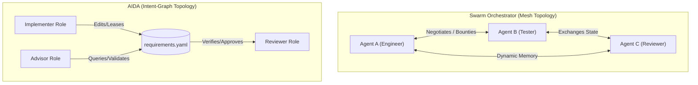

# Category Summary: Swarm Orchestrators

**Last updated**: 2026-05-22  
**Ecosystem Lens**: Multi-Agent Communication Swarms & Decentralized Protocols

As LLM inference costs continue to decline, the AI tooling ecosystem has heavily invested in **swarm orchestrators**—systems that spin up large numbers of specialized, independent agents communicating over a dynamic mesh network to solve complex software tasks.

This summary analyzes the swarm orchestration landscape, focusing on Claude Flow (Ruflo) and Swarm-Protocol (Theoriq/Rivalz), and contrasts them with AIDA's local, requirements-driven coordination model.

---

## The Landscape: Dynamic Swarms vs. Structured Graphs

Swarm orchestrators are designed to solve broad, open-ended tasks by allowing agents to negotiate, delegate, and pass messages back and forth. 

### 1. Enterprise Communication Swarms (e.g., Claude Flow)
*   **Architecture**: Rust/WASM-based runtimes hosting multi-agent networks.
*   **Mechanics**: Employs mesh and hierarchical routing topologies. Agents pass structured messages to each other, reading and writing to a persistent memory store ("AgentDB").
*   **Ideal For**: Dynamic, enterprise-scale workflows requiring complex routing rules and long-lived conversational memory across hundreds of users.
*   **The Problem**: Extremely high token overhead and latency. Because coordination relies on continuous natural-language or JSON message exchanges, agents spend a substantial portion of their context windows negotiating task boundaries rather than writing code.

### 2. Economic Agent Swarms (e.g., Swarm-Protocol)
*   **Architecture**: Decentralized blockchain protocols (e.g. Theoriq, Rivalz).
*   **Mechanics**: Coordinates independent agents through decentralized economic incentives, reputation systems, and micro-bounties.
*   **Ideal For**: Open-market resource sharing, cross-organization collaborations, and distributed service execution.
*   **The Problem**: Bypasses the local development workflow. Introducing cryptographic handshakes, network latency, and economic tokens is highly inefficient for a local developer trying to ship a software feature on a tight deadline.

---

## The AIDA Alternative: Requirements-Driven Collaboration

AIDA rejects the complexity, token bloat, and network overhead of dynamic communication swarms. Instead, AIDA coordinates agents through a **shared, git-versioned requirements graph** (`requirements.yaml`).

### How AIDA Differs:
1.  **Zero-Message Overhead**: AIDA's agents do not negotiate with each other. They interact solely by reading and writing to the requirements graph. If an Implementer completes a task, it flips the status of `STORY-407` to `Review`; this state change is immediately visible to the Reviewer, who automatically claims it. The graph itself serves as the sole communication medium.
2.  **Role-Pure Boundaries**: Instead of dynamically spawning agents that define their own boundaries, AIDA restricts agents to three strict, pre-configured lifecycle roles (Advisor, Implementer, Reviewer) operating in isolated git worktrees. This prevents context drift and ensures absolute domain focus.
3.  **Local and Instant**: By storing all state locally in the repository under `.aida-store/`, AIDA operates at filesystem speeds with zero external network dependencies, ensuring maximum performance for solo developers.

---

## Swarm Comparison Matrix

| Capability | Enterprise Swarms (Claude Flow) | Economic Swarms (Swarm-Protocol) | AIDA (Intent-Graph) |
|---|---|---|---|
| **Coordination Vehicle** | Dynamic Agent Mesh (AgentDB) | Blockchain / Reputation | Git-Native Requirements Graph |
| **Communication Overhead** | High (Continuous LLM Chat) | High (Network Handshakes) | **Zero (Local State Changes)** |
| **Workspace Isolation** | Process-level (Docker) | Node-level (Decentralized) | **Git-Native (Local Worktrees)** |
| **Best Suited For** | Multi-user enterprise pipelines | Multi-org service markets | **Solo developer pairing with agents** |
| **Setup Cost** | Heavy (Server infra, databases) | Complex (Wallets, reputation) | **Instant (Local CLI + YAML)** |

---

## Strategic Summary

Dynamic communication swarms are powerful for open-ended, multi-tenant workflows, but they introduce unacceptable latency, token consumption, and configuration overhead for daily software engineering. By centering agent collaboration on a local, compiler-verifiable requirements graph, AIDA delivers a lightweight, highly efficient alternative that supercharges local developer productivity without the swarm bloat.
