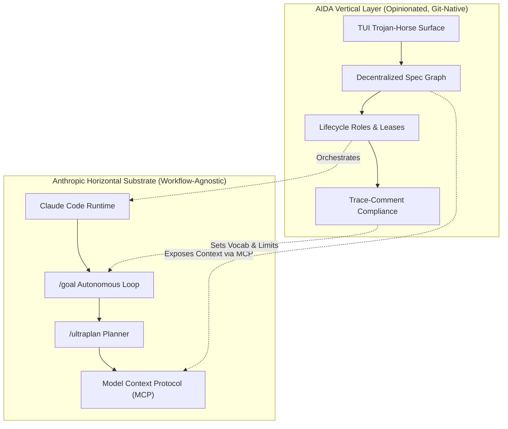

# Strategic Positioning: AIDA's Defensible Niche

**Last updated**: 2026-05-22  
**Ecosystem Cadence**: Quarterly Scan / Signal-Triggered

As Anthropic, OpenAI, and other platform providers ship increasingly capable **horizontal primitives**—such as autonomous loops (`/goal`), multi-agent planners (`/ultraplan`), and native terminal interfaces—newcomers in the AI developer tooling space face a crucial question: *Why does AIDA exist?*

This document codifies AIDA's strategic positioning and maps its **defensible niche** in a rapidly consolidating landscape.

---

## The Horizontal-Vertical Symbiosis

Anthropic's horizontal primitives are workflow-agnostic. They are designed to fit every developer but hold no opinion about any specific software engineering discipline. 

AIDA operates as an opinionated, **vertical layer** focused on a single, high-leverage domain: **agent-collaboration on project intent**. Rather than competing with the horizontal substrate, AIDA verticalizes it.

The composition is symbiotic, not competitive:

| Horizontal Primitive (Anthropic) | Vertical Extension (AIDA) | Defensive Advantage |
|---|---|---|
| **`Claude Code` / Runtime** | **Worktree-Isolated Sessions** | Prevents concurrent write conflicts and keeps main workspace clean. |
| **`/goal` (Autonomous Loop)** | **Precise Spec Vocabularies** | Translates ambiguous prompts into machine-checkable conditions. |
| **`/ultraplan` (Cloud Planner)** | **Git-Versioned Persistence** | Saves, links, and verifies plans directly in the codebase. |
| **`MCP` (Context Protocol)** | **Requirements Graph Server** | Feeds structured dependency schemas directly to LLM context. |

---

## The 8 Pillars of AIDA's Defensible Niche

AIDA's architecture is anchored by eight durable claims that cannot be easily replicated by generic agent wrappers or horizontal LLM platforms.

### 1. Spec Graph Backbone
Project intent is not treated as transient text, but as a directed acyclic graph (DAG) of typed relationships (e.g., `EPIC` $\rightarrow$ `STORY` $\rightarrow$ `TASK`/`BUG`). This program-addressable, decentralized requirements graph is stored directly in the repository, making it fully version-controlled, auditable, and refactorable.

### 2. Identity Stability
Unlike standard agent chat histories that dissolve once a terminal session closes, AIDA enforces **durable node-aware identities** (e.g., `STORY-260`, `TASK-419`). These IDs persist across branches, merges, refactors, and multi-agent context windows, serving as permanent anchors for all generated plans, logs, and code.

### 3. Trace-Comment Enforcement
AIDA bridges the gap between specifications and source code via **trace-comment compliance**. By inserting light, standardized comments in the code linking to stable spec IDs, agents can programmatically verify that every line of written code has an explicit, authorized origin. It turns static documentation into a dynamic compiler check.

### 4. Discipline-First Workflow
AIDA rejects the "write first, ask later" agent anti-pattern. Through automated checks like `aida plan verify` and structured review cycles, AIDA forces agents (and humans) to declare their intent, map dependencies, obtain structured feedback, and define verification steps before modifying a single line of production code.

### 5. Lifecycle-Specific Roles
Monolithic "do-everything" agents are highly prone to hallucination and scope drift. AIDA decomposes software delivery into three role-pure, isolated workspaces:
*   **The Advisor**: Researches context, verifies relationships, and flags design conflicts.
*   **The Implementer**: Executes code changes inside an isolated, temporary git worktree.
*   **The Reviewer**: Performs adversarial verification against requirements, ensuring compliance.

### 6. Trojan-Horse Surface (TUI-First)
The visible product is a humble, lightning-fast Terminal User Interface (TUI) that hosts Claude Code. The intended first impression is: *"So what? I could write this wrapper in 20 lines of bash."*
This simplicity lowers adoption barriers. Once installed, the user quietly discovers AIDA's actual depth—the YAML canonical store, PTY survivability, MCP requirement servers, and role-based workspace routing. The TUI is the bait; the platform is the hook.

### 7. Git-Native Structure
AIDA maintains no central SaaS database. The entire requirements ledger, trace index, and plan history live under the `.aida-store/` directory and `requirements.yaml`. Because intent is stored as standard text in the repository, it naturally subject to code review, git branching, and merge conflict resolution alongside production code.

### 8. Solo-User-First Design
AIDA is not designed to coordinate massive enterprise teams. It is built to supercharge a **single developer pairing with multiple silicon interns**. By optimizing for solo-user-first mechanics, AIDA bypasses the friction of multi-tenant syncing, complex permissions, and SaaS account overhead, yielding immediate developer utility.

---

## Strategic Verdict

The platform is what AIDA actually is; the TUI is just the surface that exposes it. If a competitor attempts to duplicate AIDA's terminal interface, they must also duplicate its git-native canonical store, stable ID index, role-based isolation, and trace compiler. By anchoring its value in the local filesystem and git-native state, AIDA remains uniquely defensible in an increasingly cloud-reliant AI landscape.
