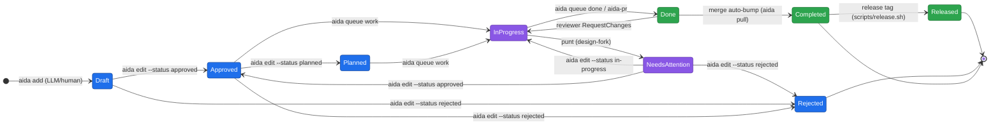
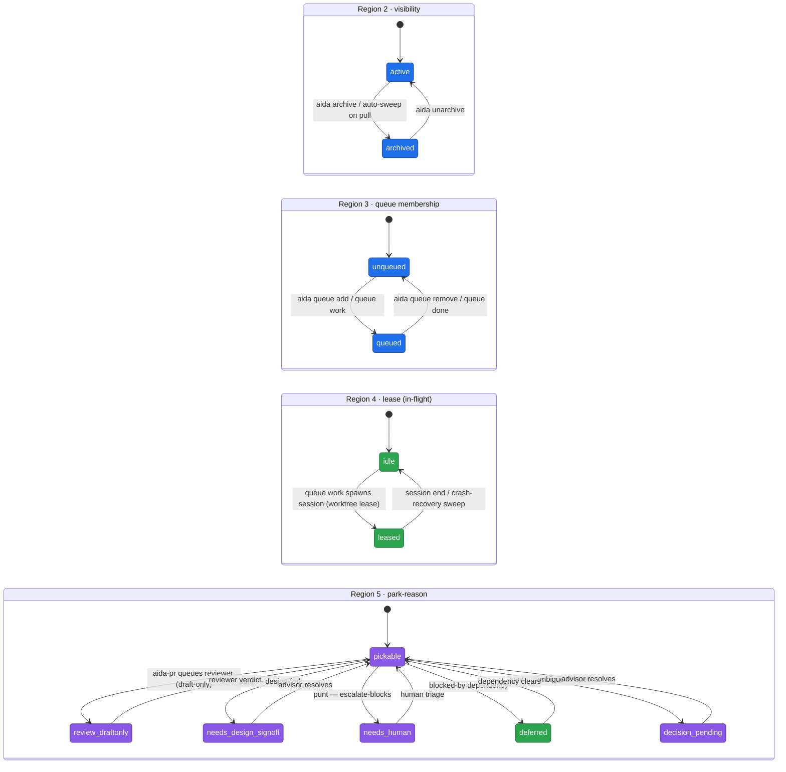

# Spec lifecycle

<!-- trace:TASK-273 | ai:claude -->

Every spec in AIDA travels the same path from "filed an idea" to "users have
it." The README has the [diagram and tables at a glance](../README.md#spec-lifecycle);
this document is the full treatment — the prose behind each state, the precise
verb for each transition, and the edge cases (cluster PRs, parallel
pipelining, autonomous drains) that the README's map leaves out.

If you know git but not AIDA's vocabulary, the one thing to internalise is
that **"merged" and "completed" are not the same event** and **"merged" and
"released" are not the same event**. The rest of this doc unpacks why.

## The lifecycle states

A spec's `status` field moves through up to seven mainline values, plus one
off-mainline pause state. List or filter on any of them with
`aida list --status <state>`.

| State | Meaning | How it gets here |
|-------|---------|------------------|
| **Draft** | Filed, not yet agreed. An idea captured so it isn't lost. | `aida add` (the default status) |
| **Approved** | Agreed and well-formed — ready to be scheduled. | `aida edit SPEC --status approved` |
| **Planned** | Scheduled into a sprint or work cycle. *Optional* — many specs go straight from Approved to In Progress. | `aida edit SPEC --status planned`, or `/aida-plan` decomposition |
| **In Progress** | Someone (usually a Claude session) is actively writing the code. | `aida queue work SPEC` spawns the session and flips the status |
| **Done** | The work is finished **on a branch** — a PR is open, but it has not landed on `main` yet. | `aida queue done SPEC`, or `/aida-pr` |
| **Completed** | The work is **merged to `main`**. This is the terminal status for a spec. | auto-bumped by `aida pull` when a commit referencing the spec lands on the default branch |
| **Released** | Not a spec status — a *cross-spec* milestone. Many Completed specs aggregate into one tagged, published version. | `make release-minor` (or `scripts/release.sh`) |

### The off-mainline state: Needs Attention

| State | Meaning | How it gets here |
|-------|---------|------------------|
| **Needs Attention** | A spec that was **In Progress** but is now **paused** — an autonomous agent hit a design-fork it could not safely resolve and **punted** rather than guess. | `aida punt SPEC` / `/aida-punt` |

**Needs Attention** is the design-fork safety net for autonomous drains
(STORY-332). When a `--no-human` implementer or reviewer hits a decision it
cannot safely make — two valid designs and the spec is silent, an ambiguous
spec, missing context, a blocking dependency — guessing produces a *silent
wrong implementation*. Punting instead pauses the spec with a structured
reason: an obstacle **category** (`design-fork` / `ambiguous-spec` /
`missing-context` / `blocked-dependency` / `other`), a human-readable
**detail**, and an optional **lean** (the agent's best-guess-if-forced).

- Reached **only from In Progress** — punting is the "I was working this and
  hit a fork" move; `aida punt` refuses any other source state.
- A Needs Attention spec is **excluded from normal queue pickup** (it is not
  "what to pick up next") but is **not terminal** — it still shows in
  `aida list` and surfaces in `aida findings` for triage. A Needs Attention
  spec *is* a punt awaiting triage.
- Resolved out **only to Approved, In Progress, or Rejected**:
  `aida edit SPEC --status in-progress` resumes it; `--status rejected`
  drops it. The structured reason is cleared once it leaves Needs Attention;
  the punt ledger (`.aida/punts.jsonl`) keeps the durable history.

The full punt mechanism — when to punt, the obstacle categories, and the
`aida punt` invocation — is documented in the `/aida-punt` skill
(`.claude/skills/aida-punt.md`).

The load-bearing distinction is **Done vs Completed** (STORY-86): `done`
means "work finished on a branch"; `completed` means "merged to the default
branch." You rarely set `completed` by hand — `aida pull` and
`aida db sync --pull` auto-bump `done → completed` once a commit referencing
the spec lands on `main`. If the auto-bump ever misses, replay it with
`aida db reconcile-status`.

## Status vs. "workable" — pickability and the queue

<!-- trace:STORY-565 | ai:claude -->

`status` tells you **where a spec is in its life**. It does **not** tell you
whether an autonomous agent can pick it up and work it *right now*. Those are two
different questions, and conflating them is the single most common source of
*"I asked the system to drain the queue and stuff is still sitting there."*

**Pickability** is the second axis. An item is **autonomously workable** —
`aida burndown run` (the unattended drain) or `aida queue work` will take it —
only when *all five* of these hold:

| Gate | What it checks |
|------|----------------|
| **Queued** | it's in a queue (queue membership = the advisor's sign-off that it's worth doing) |
| **Approved** | groomed and agreed — not a raw Draft |
| **Unblocked** | no `BlockedBy` edge pointing at an unfinished spec |
| **Decision-free** | no open question (`DecisionRequest`) attached |
| **No parking tag** | not tagged `review:draft-only`, `needs-human`, `needs-supervised-build`, `deferred:*`, `human-only`, or `blocked` |

If all five hold, the spec is **Ready** and an agent will take it. If *any*
fails, the spec is **Parked**, and **the failing gate is your "what to do
next."** Ask `aida why <SPEC>` — it names the bucket and the reason — or read the
"To empty this queue" footer on `aida queue list`.

### The queue is not the drain-list

This is the key reframe. **Your queue holds work in many states at once** —
review-held drafts, in-progress builds, decisions waiting on you, keyboard-only
work, research spikes. `aida burndown run` only takes the *Ready* subset (the
five gates above). **Everything else stays in the queue on purpose**, each
waiting on a *specific human act*:

| You see | It means | You do |
|---------|----------|--------|
| tag `review:draft-only` | built, held for your sign-off | `aida review <SPEC>` |
| status `In Progress` | an agent is working it right now | wait for its PR |
| tag `needs-supervised-build` | clear to build, but at your keyboard | `aida queue work <SPEC> --zen` |
| `needs-decision` / pending question | a call only you can make | `aida questions answer <SPEC>` |
| tag `deferred:*` | deliberately shelved | nothing, or un-defer when ready |
| tag `human-only` (often a spike) | research/judgment, not code | do it yourself, then mark it done |

So *"I drained the queue and items remain"* almost always means the remaining
items were **never autonomously drainable** — they each need you. That's working
as intended; the historical gap was that nothing *showed* you the per-item next
action. `aida queue list`'s footer and `aida queue advance` (which walks each
parked item to its action interactively) now close that gap.

### What runs in parallel

- **Many builds at once.** Each `aida queue work … --zen` (and each agent in a
  `burndown run`) works in its own isolated copy of the code, and a *lease*
  ("this spec is taken") stops two agents grabbing the same one. So N different
  specs build simultaneously.
- **Review runs alongside builds.** `aida review <SPEC>` on a finished spec
  doesn't block other builds.
- **The one serial point is merging to `main`.** Build many in parallel; land
  them one at a time. A post-merge "does integrated `main` still build?" check
  guards against two PRs that were each green separately but conflict together.

### Spikes and other non-code specs have a different path

Not every spec is code an agent writes. A **Spike** (research/investigation) or a
strategic **Decision** is `human-only` because its *deliverable is a finding or a
judgment*, not a diff. You never `aida queue work` a spike — that launches a
coder with nothing to code. Its lifecycle is `Approved → [a human, or the
advisor, does the investigation and records it] → Completed`. No agent, no PR, no
merge. The same holds for `vision`, `principle`, `decision`, and `term` specs —
they're authored and agreed, not implemented.

## Plain glossary

AIDA grew its own vocabulary; here it is in plain words.

| Term | Plain meaning |
|------|---------------|
| **worktree** | a throwaway *copy of the code in its own folder*, so one agent can work without colliding with another. "Prune the worktree" = delete that temp folder once the work is merged. |
| **lease** | a *"this spec is taken"* marker, so two agents don't grab the same one. Cleared when the agent finishes. |
| **`aida session end`** | the cleanup step — delete the temp folder and clear the lease. |
| **`--zen`** | run **one** coding agent on **one** spec, at your keyboard, so you can watch it. |
| **burndown** | the unattended version — fan out **many** agents at once to clear the Ready set. |
| **brief / mailbox** | a note one agent leaves another in a shared folder (`.aida/agent-briefs/`), e.g. "I finished X, here's the PR, please review." |
| **PR** | GitHub "Pull Request" — a bundle of proposed code changes to review and merge. |
| **parked** | a queued spec that one of the five gates is blocking — *not* autonomously workable until the gate clears. |
| **Ready** | a queued spec that passes all five gates — an agent will take it. |
| **the "open set"** | every spec that isn't Completed, Rejected, or archived — the specs still "in play" (`aida why` and `aida list open` work over this set). |

## The state diagram

<!-- trace:TASK-733 -->

> **Frozen snapshot — 2026-06-10.** This diagram is a point-in-time
> hand-drawn map, deliberately *not* elaborately hand-maintained. When the
> machinery drifts from it, trust the prose above and the `RequirementType` /
> transition code over the picture. The un-driftable, generated-from-source
> version is the goal of the `aida lifecycle` SPIKE (SPIKE-56) — once that
> ships, this block becomes a generated artifact and the date stops mattering.

The prose above describes the lifecycle as a chain, but a spec's *real* state
is not one value — it is **five orthogonal coordinates** that move
independently. The status chain is only the first. The diagram below shows the
status chain as a state machine, then the four other regions as separate
tracks, with a note that they are orthogonal (a spec is one row from each
region simultaneously — e.g. `InProgress` × `active` × `queued` × `leased` ×
`pickable`).

### Region 1 — `status` chain (the mainline)

A state's fill marks **which trigger kind most often drives entry into it** —
see the legend below. (Most transitions out of a state are also labelled with
their driving command.) Because Mermaid colours nodes, not edges, the fill is a
coarse hint; the edge labels carry the precise driver.

### Regions 2–5 — the orthogonal coordinates

These four tracks are **not** part of the status chain. Each is an independent
flag that moves on its own trigger, at any point in the status chain. A spec
holds exactly one value from *each* region at once.

**Orthogonal, not sequential.** A `Completed` spec can still be `active` (not
yet archived); an `InProgress` spec can be `queued` + `leased` + `pickable`
all at once; an archived spec keeps its frozen status. Read the five regions as
five dials, each turned by its own trigger.

### Legend — the three trigger kinds

| Colour | Trigger kind | Who pulls it | Examples |
|--------|--------------|--------------|----------|
| 🔵 **blue** | **CLI / human command** | A person (or script) runs an `aida` verb | `aida edit --status approved`, `aida queue add`, `aida archive`, `aida unarchive` |
| 🟣 **purple** | **LLM decision** | A Claude session decides and acts | `aida queue work` starts implementing, `punt` on a design-fork, reviewer verdict, advisor resolves a punt |
| 🟢 **green** | **system / git-event** | A git event or background sweep fires it, no human in the loop | merge auto-bump (`done → completed` on `aida pull`), release tag, crash-recovery lease sweep, blocked-by dependency clearing |

The boundary between blue and purple is *who decides*: a human typing
`aida edit --status approved` is blue; a Claude session deciding to `punt`
rather than guess is purple. Green is the substrate moving a spec with **no
decision at all** — the merge commit lands and the auto-bump just happens.

### Don't let this happen — illegal orthogonal combinations

The regions are independent, but not *every* combination is legal. Two have
bitten us and are now guarded:

- **`archived` AND `queued`** — an archived spec must never sit in a work
  queue. Archiving is "hidden from default views"; a queued archived spec is
  invisible-but-pickable, so a drain picks up work the human thinks is gone.
  `aida archive` now refuses (or de-queues) a queued spec. (BUG-492)
- **`review:draft-only` (held-for-review) AND PR-closed** — a spec parked
  "held for review" whose PR has already been closed/merged is a contradiction:
  the review gate is waiting on a PR that no longer needs it. The held-reason is
  now reconciled against real PR state so the spec doesn't wedge. (BUG-493)

The rule of thumb: a park-reason or visibility flag must always be *consistent
with* the spec's queue/lease/PR reality. When they diverge, the spec silently
falls out of the flow — which is exactly the failure both bugs describe.

## What "shipped" means — the verbs

"Ship" collapses six distinct steps into one fuzzy word. Across a long
working session, different specs sit at different steps; a precise verb lets
anyone tell, from a single sentence, exactly where a spec is. Use the verb,
not "shipped."

### Committed

The work exists in your **local git history** and nowhere else. The spec is
still **In Progress** — a commit is not a checkpoint other people can see.

- Command: `git commit`, or `/aida-commit` (the skill enforces the
  `[AI:tool] type(scope): description (REQ-ID)` format and links the commit
  back to its spec).

### Pushed

The branch is now reflected on `origin`. Still **In Progress** — a pushed
branch with no PR is invisible to reviewers and to CI gating.

- Command: `git push`. In the normal AIDA flow you never push by hand —
  `/aida-pr` pushes the branch as its first step.

### PR opened

A pull request exists on GitHub, awaiting CI and review. The spec flips to
**Done**: the work is finished on a branch, but not on `main`.

- Command: `/aida-pr` — pushes the branch, opens the PR, and queues a
  reviewer story so the work routes to the `reviewer` role automatically.

### Reviewed

A reviewer has read the diff and rendered a verdict — approved, or
changes requested. The spec is **still Done**: a verdict is not a merge.
A "request changes" verdict sends the spec back to In Progress work without
changing the queue entry.

- Command: `/aida-review` inside a reviewer session (`aida queue work PR-N`
  spawns one). Findings from a headless reviewer surface via
  `aida findings list`.

### Merged

The PR squashed onto `main`. This is AIDA's default meaning of **"shipped"** —
the developer-facing "out the door." The spec **should auto-bump to
Completed**: the next `aida pull` detects the merge commit and promotes the
status.

- Command: `gh pr merge N --squash --delete-branch`, followed by `aida pull`
  to promote the status. The `--auto-complete` orchestrator does both for you.
  When merging by hand from inside a worktree, `--delete-branch` can trip on a
  cosmetic "branch in use by worktree" error — see the worktree-aware recovery
  recipes in `docs/autonomous-drain.md`. trace:TASK-406

### Released

A version tag exists and binary tarballs are published. **Released is
cross-spec** — it aggregates every spec merged since the last tag. A merge
does **not** auto-release; releasing is a deliberate, separate act.

- Command: `make release-minor` (or `scripts/release.sh {major|minor|patch}`)
  — bumps the workspace version, generates tag notes from the commit log,
  commits, tags, and pushes, which triggers the release workflow to build and
  publish tarballs. Releases are gated on a green cross-platform CI run.

Better phrasing, in practice:

- ~~"TASK-12 shipped"~~ → "TASK-12's PR merged" / "TASK-12 is on `main`"
- ~~"shipped it to a PR"~~ → "opened a PR for TASK-12"
- ~~"v0.8 shipped"~~ → "v0.8.0 was released" (binaries published)

## Edge cases

The README diagram shows one spec moving cleanly through the path. Real work
rarely looks that linear.

### Cluster PRs

A parent scope — an EPIC, or a planned cluster of related specs — often ships
as **one PR, not one PR per child**. `aida queue work <EPIC-N>` drains every
child spec into a single branch and session; `/aida-pr` then opens one PR
covering the whole cluster. Each child still moves Draft → … → Done
individually (the session manifest tracks `✓ / ◐ / ○` per child), but they
all reach Completed together when the single cluster PR merges.

### Batches

Specs sharing a `batch:NAME` tag are a looser grouping than a parent EPIC.
`aida queue work --batch NAME` picks the head queued member; re-running after
each session drains the next. `/aida-pickup --batch NAME` continues a batch
on the *current* branch so the members accumulate as one cluster PR.
`aida queue progress --batch NAME` shows the batch's bucketed lifecycle view
(Shipped / In flight / Working now / Remaining).

### Parallel pipelining

Because `aida queue work` spawns each session in its **own git worktree**,
several specs can occupy different lifecycle states at the same time — one
spec In Progress in worktree A while another sits at Done (PR open, awaiting
CI) from worktree B. The queue and the session leases keep the parallel work
from colliding; `aida queue list` shows queued items, and a
**Done — awaiting merge** section lists what is in flight.

### Autonomous drains and `--auto-complete`

`aida queue work SPEC --auto-complete` runs the **entire lifecycle as one
command** — implement → end session → wait for CI → review → merge → pull →
build — with no manual hand-offs between the stages. The `--auto-complete=through-ci`
and `through-merge` variants stop the drain at an earlier stage.
`aida queue work --batch NAME --auto-complete` drains a whole batch this way,
one full lifecycle per member.

A `/goal` completion condition (assembled by `aida goal`) gives an autonomous
run a machine-checkable definition of done — for example "this batch is empty
and PR N is merged" — so the drain knows when the lifecycle is genuinely
finished rather than just when the current step returned.

The trade-off is real: **interactive sessions make better design decisions;
autonomous drains deliver better throughput.** Drive design-fork specs at the
keyboard; drain mechanical batches with `--auto-complete`. The full guidance
lives in [`autonomous-drain.md`](autonomous-drain.md).

## See also

- [README — Spec lifecycle](../README.md#spec-lifecycle) — the diagram and
  tables at a glance
- [`docs/git-workflow.md`](git-workflow.md) — branch, PR, and divergent-branch
  recovery mechanics
- [`docs/session-lifecycle.md`](session-lifecycle.md) — worktrees, leases,
  and session crash recovery
- [`docs/autonomous-drain.md`](autonomous-drain.md) — the headless `--no-human`
  drain and the evidence behind each flag
- The `lifecycle-vocabulary.md` discipline guide scaffolded by `aida init`
  into `docs/aida/discipline/` — the same verb vocabulary, as a habit for any
  AIDA-using project
- **SPIKE-56** (`aida lifecycle`) — the future generated-from-source diagram
  that will replace [the frozen state diagram](#the-state-diagram) above, so
  the picture can't drift from the transition code
