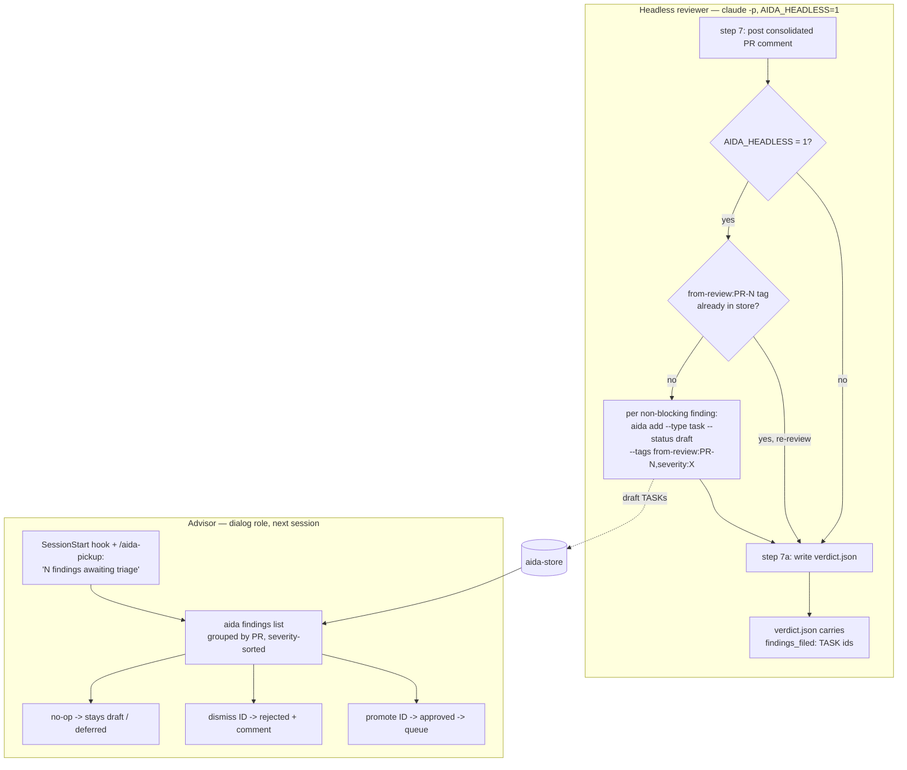

# STORY-278 — Headless reviewer findings reach advisor for triage

**Date:** 2026-05-17 · **Specs:** STORY-278 · **Status:** Planned · **Complexity:** Medium

> Archive this plan to `docs/plans/2026-05-17-story-278-findings-triage.md` as the first implementation step (`docs/plans/_TEMPLATE.md` structure).

## Context

Under `--no-human` (STORY-263 headless reviewer), the reviewer surfaces non-blocking findings — clippy noise, drifted refs, small bugs — that a human would normally feed back to the **dialog/advisor** role to file as follow-up TASKs. Headless, those findings live only in a GitHub PR comment + the verdict JSON's pass/fail bit; the drain moves on and **nobody files them**. STORY-263's own self-test proved this: PR-64 raised four findings, all filed manually only because a human was watching.

The fix (spec "option 3"): the headless reviewer files each finding as `TASK --status draft --tags "from-review:PR-N,severity:..."`. Advisor triage becomes a status flip — `aida findings list` (a query, not a new taxonomy) surfaces them; `promote` → `approved` (joins queue), `dismiss` → `rejected`. No new requirement type.

## Approach

Two writers, one query surface. The **reviewer side** is skill-driven: the `/aida-review` skill, when running headless, files findings via plain `aida add` after posting its PR comment. The **advisor side** is a new Rust subcommand `aida findings {list,dismiss,promote}` plus session-start surfacing. The headless signal is a new `AIDA_HEADLESS=1` env var set by `exec_claude_headless`.

One correction to the spec's framing: `aida findings list` **cannot** be a literal shell alias for `aida list --tags 'from-review:*'` — `aida list`'s `--tags` filter is exact-string match (`cache.rs` builds `LIKE '%"<tag>"%'`), so the `from-review:*` glob would match nothing. `aida findings` is therefore a real subcommand whose handler does the prefix match in Rust.



## Decisions

1. **Filing is skill-driven, not Rust PR-comment parsing.** Only the reviewer Claude has the findings (they live in `.aida/review-prompt-pr-N.md`). The spec mandates "via `aida add`". The Rust side owns the deterministic *query* surface; the *write* stays in the skill.
2. **`AIDA_HEADLESS=1` env var gates the auto-filing.** The gap is specific to `--no-human`: in interactive `--auto-complete` the phase-3 reviewer is a human who already triages from the PR comment. `exec_claude_headless` sets `AIDA_HEADLESS=1`; the skill keys step 7b on it. Reusable later for STORY-276 / TASK-298.
3. **`aida findings` is a real subcommand, not a shell alias.** `aida list --tags` is exact-match — the `from-review:` prefix glob needs a dedicated handler.
4. **Prefix match happens in the CLI handler, not a new cache-layer field.** `findings list` queries `list_summaries(status=draft)` then retains tag-prefix `from-review:` in Rust. The draft set is small; no `ListFilter.tag_prefix` needed.
5. **Findings are always `--type task`** — even bug-shaped ones. Option 3 forbids taxonomy expansion; the advisor can `aida edit <ID> --type bug` on promote if warranted.
6. **Idempotency is all-or-nothing per PR.** The skill probes `aida list --tags from-review:PR-N --all` (the `--all` is required — a previously promoted/dismissed finding is terminal-status and hidden by default). Any hit → skip the whole filing block, matching the spec's "if existing, skip".
7. **`dismiss`/`promote` write through the backend directly**, not by shelling `aida edit`. The terminal-status guard (TASK-47) and lease enforcement (STORY-48) are inapplicable to a draft finding TASK. A `is_review_finding()` guard keeps the alias honest.
8. **dialog surfacing reuses the existing `aida-role-context.sh` SessionStart hook**; doer-role surfacing lives in the `/aida-pickup` skill. The two surfaces don't overlap (pickup skips the dialog role), so no double-surfacing and no new hook / no `settings.json` change.

## Files (in build-order)

### Commit 1 — `aida findings` command (Rust)

**`aida-cli/src/findings.rs`** *(new module — pure, fully unit-tested, mirrors the `auto_complete.rs` precedent)*
- `enum Severity { Major, Minor, Cosmetic, Unknown }` with `fn rank(self) -> u8` (Major=0 … Unknown=3) and `fn parse(tag_value: &str) -> Severity`.
- `fn pr_number_from_tag(tag: &str) -> Option<u32>` — `strip_prefix("from-review:PR-")` then parse.
- `fn is_review_finding(tags: &[String]) -> bool` — any tag starts with `from-review:`.
- `fn finding_pr(tags) -> Option<u32>` / `fn finding_severity(tags) -> Severity`.
- `pub struct FindingRow { display_id, title, pr, severity }` and `pub struct PrGroup { pr: Option<u32>, rows: Vec<FindingRow> }`.
- `pub fn build_findings_view(summaries: &[aida_core::RequirementSummary], pr_filter: Option<u32>) -> Vec<PrGroup>` — retain findings, apply `pr_filter`, group by PR (groups sorted PR-desc, `None` last), sort each group's rows by `Severity::rank`.
- `#[cfg(test)] mod tests`.

**`aida-cli/src/cli.rs`** — after the `Command` enum's `Edit`/`Del` arms (~line 2876):
- `#[derive(Subcommand)] pub enum FindingsCommand { List { #[clap(long)] pr: Option<u32>, #[clap(long)] count: bool }, Dismiss { id: String }, Promote { id: String } }`.
- New `Command` variant: `/// Triage review findings filed by the headless reviewer.\n#[clap(subcommand)] Findings(FindingsCommand)` (visible, not `hide`).

**`aida-cli/src/main.rs`**
- Top: `mod findings;` (after `mod docs;`).
- Legacy-backend dispatch (the exhaustive `match` ending ~line 851, alongside `Command::Doc(_)`): add `Command::Findings(_) => anyhow::bail!("aida findings requires the distributed git-canonical store ...")`.
- Git-canonical dispatch (the exhaustive `match`, near `Command::List` ~line 1740): add `Command::Findings(cmd) => handle_findings_command(cmd, &backend, store_path)?`.
- New `fn handle_findings_command(cmd: &FindingsCommand, backend: &CachedGitBackend, store_path: &Path) -> Result<()>`:
  - **List**: `backend.list_summaries(&ListFilter { status: Some("draft".into()), ..Default::default() })` → `findings::build_findings_view(&summaries, *pr)`. If `count` → `println!("{}", total_rows)`. Else print the triage view: header `Findings awaiting triage (N)`, then per PR group `PR-<n>` with `<severity>  <id>  <title>` rows; empty → `No findings awaiting triage.`. Do **not** apply `active_role_scope()`.
  - **Dismiss**: `backend.get_requirement_by_spec_id(id)?` → `not_found::requirement_not_found` on miss → guard `findings::is_review_finding(&req.tags…)` (bail pointing at `aida edit` otherwise) → push an `aida_core::Comment` (author `get_default_author()`, body `"Dismissed by advisor during findings triage."`) → `req.set_status_from_str("rejected")` → `req.modified_at = now` → `backend.update_requirement(&req)?`.
  - **Promote**: same lookup + finding guard → `req.set_status_from_str("approved")` → `update_requirement`.
- Inline `#[cfg(test)]` test for `is_review_finding` guard message (optional — core view tests live in `findings.rs`).

*Builds clean:* the enum, both match arms, and the handler land in one commit.

### Commit 2 — `AIDA_HEADLESS` env var (Rust)

**`aida-cli/src/session.rs`** — `exec_claude_headless`: add `cmd.env("AIDA_HEADLESS", "1")` before the `exec()` / `status()` call; extend the doc comment to note the var. (Set on the `Command`, so `execve` carries it.)

**`aida-cli/src/main.rs`** — the `--no-launch` headless hint print (~line 42970): prefix the echoed command with `AIDA_HEADLESS=1 ` so the printed reproduction is faithful.

### Commit 3 — skill / hook / docs (markdown + shell, no build impact)

**`aida-core/templates/skills/aida-review.md`** — insert **step 7b "File non-blocking findings (headless)"**, positioned after step 7 (consolidated comment) and before step 7a (verdict file):
- Gate: only when `AIDA_HEADLESS=1`.
- Idempotency probe: `aida list --tags from-review:PR-<N> --all` — non-empty → skip filing entirely (re-review case).
- For each non-blocking finding in the worksheet (⚠️ PARTIAL rows + adversarial deep-pass observations that did *not* sink the verdict — ❌ FAIL is a blocker, not a finding): run `aida add --type task --status draft --tags "from-review:PR-<N>,severity:<cosmetic|minor|major>[,<context>]" --title "<one-line>" --description-stdin <<'EOF' … EOF`. Description = full finding text + the PR comment URL captured from step 7's `gh pr comment` output. Collect the printed `<ID>`s.
- Then step 7a's verdict-JSON template gains a `"findings_filed": [<ids>]` field (empty `[]` when not headless or skipped).
- Note severity rubric: fmt/clippy/comment-nits = `cosmetic`; real-but-small bug = `minor`; design concern = `major`. Findings are always `--type task` (advisor re-types on promote if it is really a bug).

**`aida-core/templates/skills/aida-pickup.md`** — add a `## Pending findings` dynamic-context block:
```
!`c=$(aida findings list --count 2>/dev/null || echo 0); [ "${c:-0}" -gt 0 ] && echo "$c findings from recent merges awaiting triage (use \`aida findings list\` to review)" || true`
```
and one workflow line in Step 1: if that block emitted a line, surface it to the user.

**`aida-core/templates/commands/aida-pickup.md`** — one-line addition mirroring the skill (optional, for parity).

**`aida-core/templates/hooks/aida-role-context.sh`** — when `role = dialog`, compute
`n=$(aida findings list --count 2>/dev/null || echo 0)` and, if `n > 0`, append
`N findings from recent merges awaiting triage (use \`aida findings list\` to review)` to `$body`. Fold the findings line into the line-84 "is `$body` worth emitting" guard so a dialog session with the line but no `purpose`/`system_prompt` still emits.

**`docs/autonomous-drain.md`** — short subsection: how headless-reviewer findings reach the advisor (`AIDA_HEADLESS` → step 7b → `aida findings list`).

Then run `make sync-templates` to verify the `.claude/` symlinks.

## Critical Files

- `aida-cli/src/findings.rs` *(new)*
- `aida-cli/src/cli.rs`
- `aida-cli/src/main.rs`
- `aida-cli/src/session.rs`
- `aida-core/templates/skills/aida-review.md`
- `aida-core/templates/skills/aida-pickup.md`
- `aida-core/templates/hooks/aida-role-context.sh`

## Reusable helpers

- `backend.list_summaries(&ListFilter { … })` — cache-backed query (`aida-core/src/db/cache.rs:231`); `aida_core::ListFilter` struct (`cache.rs:45`).
- `backend.get_requirement_by_spec_id(id)?` / `backend.update_requirement(&req)?` — backend read/write (used by `Command::Edit`, `Command::Comment(Add)` in `main.rs`).
- `req.set_status_from_str(canonical)` — status mutation (`Command::Edit` handler).
- `aida_core::Comment` struct + `get_default_author()` — comment construction (`Command::Comment(CommentCommand::Add)` handler, `main.rs:2846`).
- `not_found::requirement_not_found(id, Some(store_path))` — id-miss error.
- `session::exec_claude_headless` / `session::claude_headless_args` — headless launch (`session.rs:636` / `:615`).
- `QueueCommand`'s `--tag-prefix` field (`cli.rs:2191`) — existing precedent for prefix-match tag filtering.
- The verdict-file handshake — `read_verdict_file` (`main.rs:43812`), `auto_complete::Verdict` — context only; not modified.

## Risks + gotchas

1. **`aida list --tags` is exact-match, not glob.** A literal `aida findings list` → `aida list --tags 'from-review:*'` alias matches nothing. → Dedicated handler does the prefix match in Rust on `RequirementSummary.tags`.
2. **Idempotency must see terminal-status findings.** A promoted (`approved`) or dismissed (`rejected`) finding is hidden by `aida list`'s default terminal filter (TASK-64); without `--all` a re-review re-files. → Skill probes with `aida list --tags from-review:PR-N --all`.
3. **Both `Command` matches are exhaustive.** Forgetting the legacy-backend arm fails compilation. → Add the `Command::Findings(_)` bail arm.
4. **Skill-driven filing is LLM-dependent**, not deterministic. → Accepted per spec ("via `aida add`"); the idempotency probe makes re-runs safe and the Rust query side makes whatever *was* filed inspectable. Determinism lives in the query, not the write.
5. **SessionStart hook 5 s timeout.** → `aida findings list --count` is one cache query (sub-ms); `2>/dev/null` + `|| echo 0` means a missing/slow `aida` degrades to no line.
6. **`dismiss`/`promote` on a non-finding spec would mis-edit.** → `is_review_finding()` guard; bail with a message pointing at `aida edit`.
7. **`exec_claude_headless` uses `exec()` on unix.** → `cmd.env("AIDA_HEADLESS","1")` is set on the `Command` before `cmd.exec()`, so `execve` carries it.
8. **Headless review is single-turn (`claude -p`).** Filing must finish in that turn. → `aida add` calls are fast and `bypassPermissions` skips gating; step 7b runs before the final verdict write so it is not stranded.

## Tests

In `aida-cli/src/findings.rs` `#[cfg(test)] mod tests`:
- `severity_rank_orders_major_minor_cosmetic`
- `severity_parse_is_tolerant` — `severity:Cosmetic` / unknown → `Unknown`
- `pr_number_from_tag_parses_and_rejects` — `from-review:PR-64` → `Some(64)`; `from-review:PR-x` / `foo` → `None`
- `is_review_finding_requires_from_review_tag`
- `build_findings_view_groups_by_pr_and_sorts_by_severity` — multi-PR input, assert PR-desc grouping + major→minor→cosmetic within a group
- `build_findings_view_pr_filter_narrows` — `pr_filter=Some(64)` drops other PRs
- `build_findings_view_drops_non_finding_drafts` — a plain draft TASK with no `from-review:` tag is excluded

(Promote/dismiss round-trip + idempotency are exercised by the Verification smoke test below — they need a real backend, and the CLI has no integration-test harness, only inline `#[test]`s.)

## Verification

Executable smoke test — run from the repo root after `cargo build --release` and `aida-on`:

```bash
set -euo pipefail
PR=99001  # throwaway PR number unlikely to collide

# --- simulate a headless --no-human reviewer filing findings for two PRs ---
A=$(aida add --type task --status draft --tags "from-review:PR-$PR,severity:major" \
      --title "STORY-278 smoke: major finding" --description "x" | grep -oE '[A-Z]+-[0-9]+' | head -1)
B=$(aida add --type task --status draft --tags "from-review:PR-$PR,severity:cosmetic,clippy" \
      --title "STORY-278 smoke: clippy noise" --description "x" | grep -oE '[A-Z]+-[0-9]+' | head -1)
C=$(aida add --type task --status draft --tags "from-review:PR-$((PR+1)),severity:minor" \
      --title "STORY-278 smoke: other PR" --description "x" | grep -oE '[A-Z]+-[0-9]+' | head -1)

# positive: triage view groups by PR, severity-sorted; --count is total; --pr narrows
aida findings list                       # expect 2 groups, PR-$PR shows major before cosmetic
test "$(aida findings list --count)" = "3"
test "$(aida findings list --pr $PR --count)" = "2"

# idempotency probe the skill uses — must be non-empty so a re-review skips
test -n "$(aida list --tags from-review:PR-$PR --all | grep -E '^[A-Z]+-[0-9]+' || true)"

# promote/dismiss round-trip
aida findings promote "$A"               # -> approved
aida findings dismiss "$B"               # -> rejected + 'dismissed-by-advisor' comment
aida show "$A" | grep -q 'Approved'
aida show "$B" | grep -q 'Rejected'
aida comment list "$B" | grep -qi 'dismissed by advisor'
test "$(aida findings list --pr $PR --count)" = "0"   # both triaged -> drop from view

# negative: dismiss on a non-finding spec must bail
! aida findings dismiss META-002 2>&1 | grep -qi 'not a review finding' && echo "FAIL: guard" || echo "guard OK"

# cleanup
aida del "$A" -y; aida del "$B" -y; aida del "$C" -y
echo "STORY-278 smoke: PASS"
```

Plus: `cargo test -p aida-cli findings` (the `findings.rs` unit tests) and `cargo build --release` (re-embeds the edited skill/hook templates via `build.rs`).

## Followups

- Orchestrator surfaces the verdict file's `findings_filed` count in the phase-3 `--json` event so the unattended-drain log shows it.
- STORY-276 headless implementer reuses step 7b's pattern for its own residual findings.
- `aida findings list --json` for machine/TUI consumers.
- `aida findings promote <ID> --type bug` shortcut for findings that are really bugs.
- Headless advisor auto-triage spike (deferred in this spec's Out-of-scope).

## Related

- **Builds on:** STORY-263 (headless reviewer + verdict-file pattern — exposed the gap), STORY-246 (verdict file handshake).
- **Composes with:** STORY-276 (headless implementer — same gap, same fix), TASK-298 (stream-json watchdog — shares the headless-output path).
- **See also:** `feedback_dialog_role_responsibilities.md` (filing is dialog's job — preserved here under headless), `feedback_pushback_on_overengineering.md` (option 3 = smallest valuable slice), `docs/autonomous-drain.md`.
